# FootBase

FootBase, futbol maclarini takip etme, mac ve oyuncu detaylarini inceleme, yorum yapma, puanlama ve rol bazli yonetim panelleri ile icerik yonetimi saglama amaciyla gelistirilmis full-stack bir platformdur.

## Proje Amaci

Bu proje, futbol odakli bir topluluk platformunda hem son kullanici deneyimini hem de yonetim akislarini tek bir sistemde birlestirmeyi hedefler:

- Kullanicilar maclari, takimlari ve oyunculari detayli goruntuleyebilir.
- Kullanicilar mac ve oyuncu iceriklerine yorum ve puanlama ile katkida bulunabilir.
- Editorler mac olusturma/guncelleme akislarini yurutur.
- Adminler onay, moderasyon ve yonetim islemlerini merkezi panelden yonetir.
- Tasarim desenleri ile kod tabani daha okunabilir, test edilebilir ve genisletilebilir hale getirilir.

## One Cikan Ozellikler

- JWT tabanli giris/kayit akisi
- Rol bazli ekran ve endpoint erisimi (`USER`, `EDITOR`, `ADMIN`)
- Mac, takim ve oyuncu detay sayfalari
- Mac yorumlari, yorum begenme ve moderasyon akisi
- Oyuncu puanlama ve istatistik endpointleri
- Bildirim altyapisi
- Editor panelinde mac yonetimi ve command tabanli islem gecmisi/undo
- Admin panelinde mac onay-red, yorum moderasyonu ve yonetim islemleri
- Swagger UI ile API dokumantasyonu

## Kullanilan Teknolojiler

### Backend

- Java 17
- Spring Boot 3.2.0
- Spring Web
- Spring Data JPA
- Spring Security
- JWT (`jjwt`)
- PostgreSQL
- SpringDoc OpenAPI / Swagger UI
- Maven

### Frontend

- React 18
- Vite
- React Router
- Axios
- Framer Motion
- Lucide React

## Tasarim Kaliplari (Design Patterns)

Proje icinde birden fazla kalip aktif olarak kullaniliyor:

- `Builder`: Mac olusturma senaryolarini farkli kombinasyonlarla kurmak icin (`MacDirector`, `StandardMacBuilder`).
- `Command`: Skor girme, mac sonlandirma, geri alma (undo) ve gecmis takibi akisi icin.
- `Chain of Responsibility`: Mac onay zinciri ve yorum moderasyon zinciri icin.
- `Observer`: Mac onay sureclerinde farkli gozlemcilere bildirim yapisi icin.
- `Strategy`: Farkli rol/degerlendirme yaklasimlarini ayristirmak icin.
- `Factory`: Kullanici turlerine gore nesne olusturma yaklasimi icin.
- `Template Method`: Mac islemlerinde ortak akisi standardize etmek icin.
- `Facade`: Mac detay/istatistik verilerini tek noktadan sunmak icin.

## Mimari Ozet

- `frontend/`: React tabanli istemci uygulamasi
- `backend/`: Spring Boot REST API
- `backend/src/main/java/com/footbase/controller`: API endpointleri
- `backend/src/main/java/com/footbase/service`: Is kurallari
- `backend/src/main/java/com/footbase/repository`: Veri erisim katmani
- `backend/src/main/java/com/footbase/entity`: Veritabani varliklari
- `backend/src/main/java/com/footbase/patterns`: Tasarim kaliplari uygulamalari
- `ekran_goruntuleri/`: README icinde kullanilan ekran goruntuleri

## Kurulum ve Calistirma

## 1) Veritabani Hazirligi (PostgreSQL)

`backend/src/main/resources/application.properties` dosyasina gore varsayilan baglanti:

- URL: `jdbc:postgresql://localhost:5432/footbase5`
- Kullanici: `postgres`
- `spring.jpa.hibernate.ddl-auto=none`

`ddl-auto=none` oldugu icin gerekli tablo/sema yapisinin veritabaninda hazir olmasi gerekir.
Projede yardimci SQL dosyalari:

- `backend/src/main/resources/bildirimler_tablo.sql`
- `backend/src/main/resources/bildirimler_tablo_duzeltilmis.sql`
- `backend/src/main/resources/yorum_begenileri_tablo.sql`
- `backend/check_oyuncu.sql`

## 2) Backend

```bash
cd backend
.\mvnw.cmd clean install
.\mvnw.cmd spring-boot:run
```

Backend varsayilan olarak `http://localhost:8080` adresinde calisir.

Swagger UI:

- `http://localhost:8080/swagger-ui.html`

## 3) Frontend

```bash
cd frontend
npm install
npm run dev
```

Frontend Vite config ile `http://localhost:3000` portunda calisir.

## Temel API Gruplari

- `api/auth`: giris, kayit, sifre sifirlama
- `api/home`: ana ekran ozet verileri
- `api/matches`: mac listesi, mac detayi, yorumlar, mac detay endpointleri
- `api/teams`: takim listesi, takim detayi, istatistik ve iliskili veriler
- `api/players`: oyuncu listesi, oyuncu detayi, puanlama, yorum ve medya
- `api/users`: profil ve kullanici bilgileri
- `api/notifications`: bildirim listesi/okundu islemleri
- `api/editor`: editor paneli mac yonetim endpointleri
- `api/admin`: admin paneli onay, moderasyon ve yonetim endpointleri

## Ekran Goruntuleri

### Genel

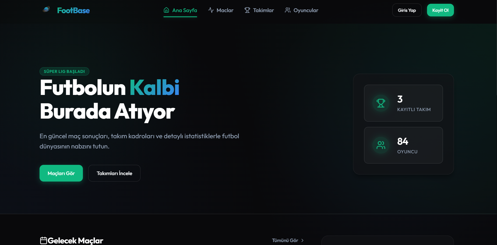
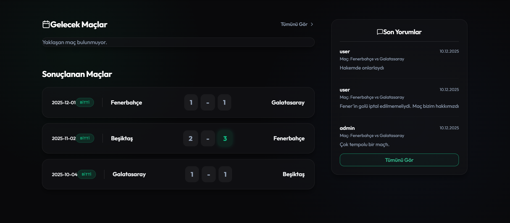

### Kimlik Dogrulama

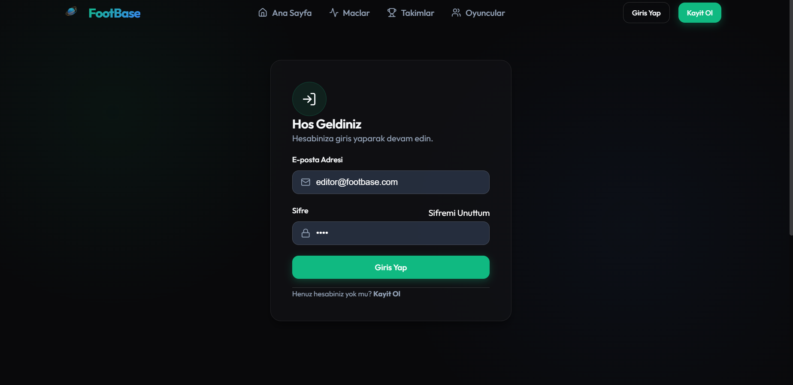
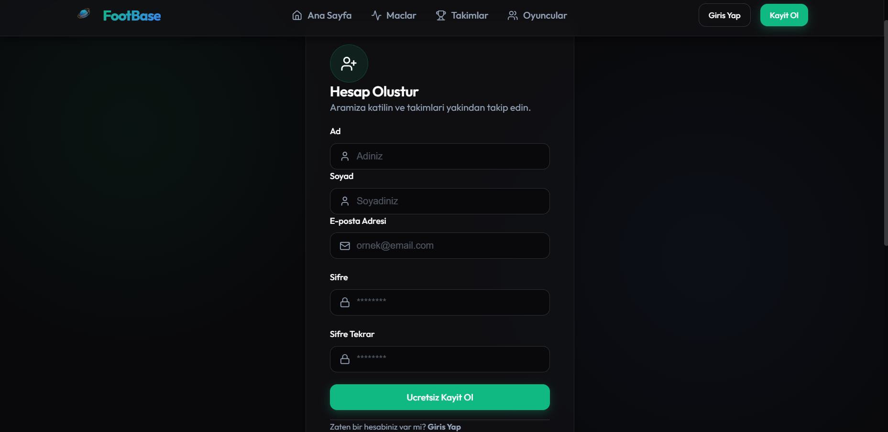

### Maclar

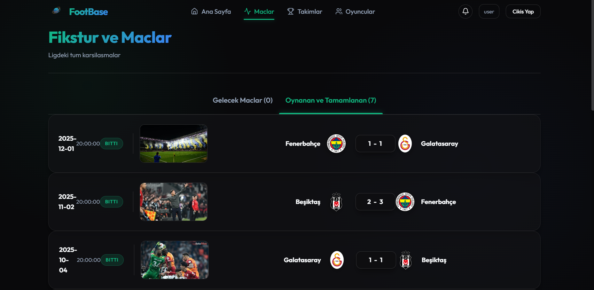
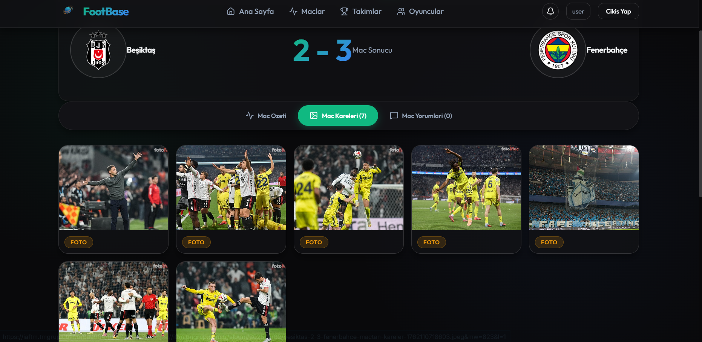

### Takimlar

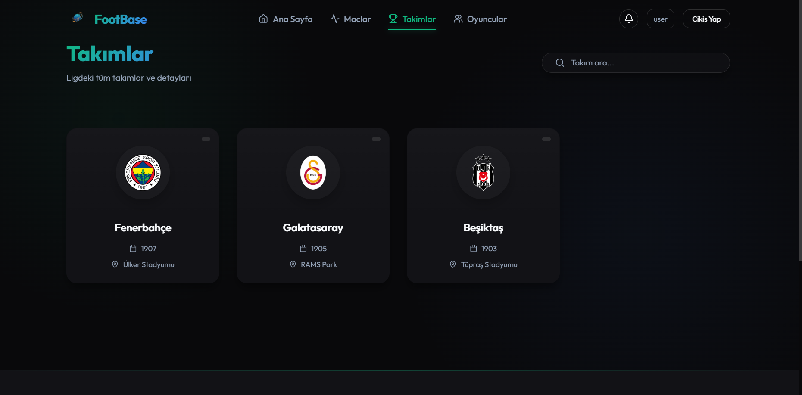
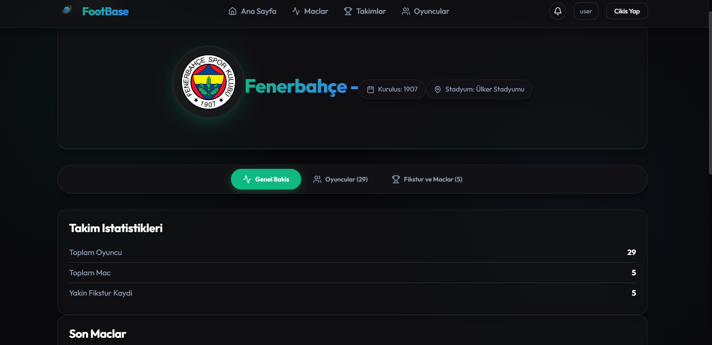

### Oyuncular

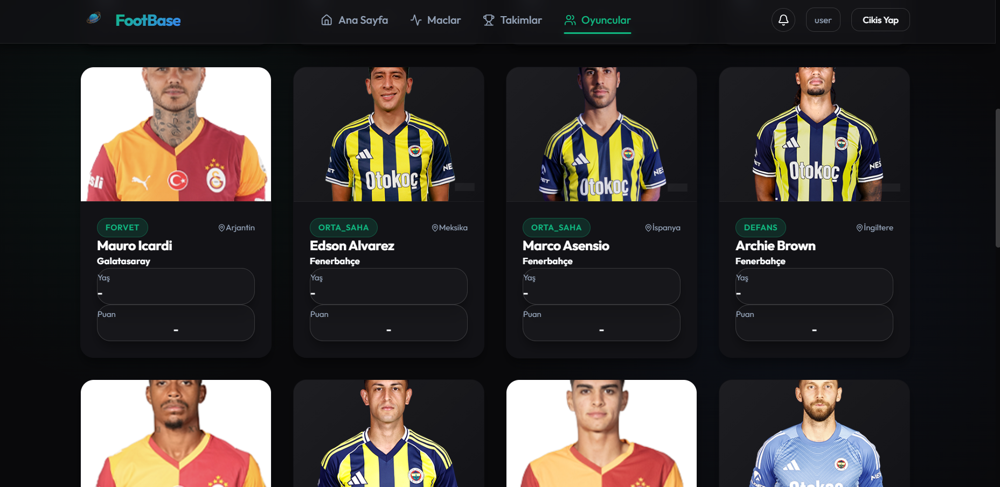
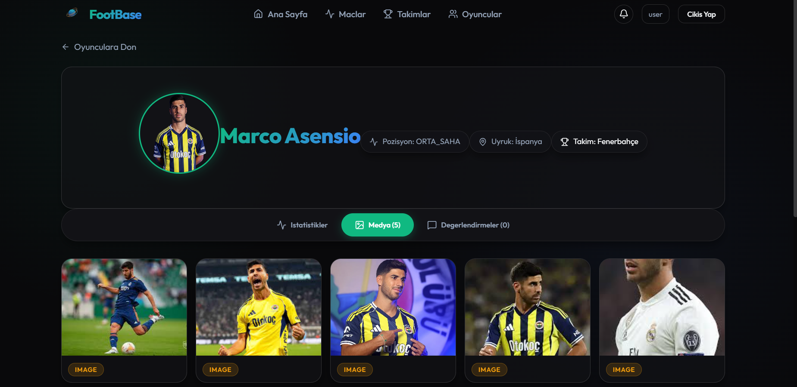

### Paneller

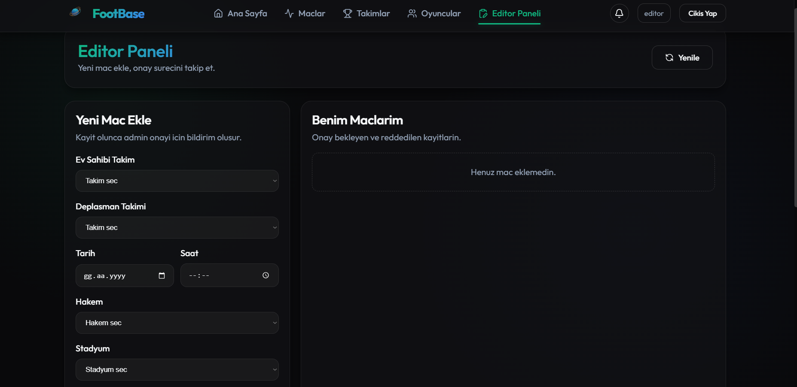
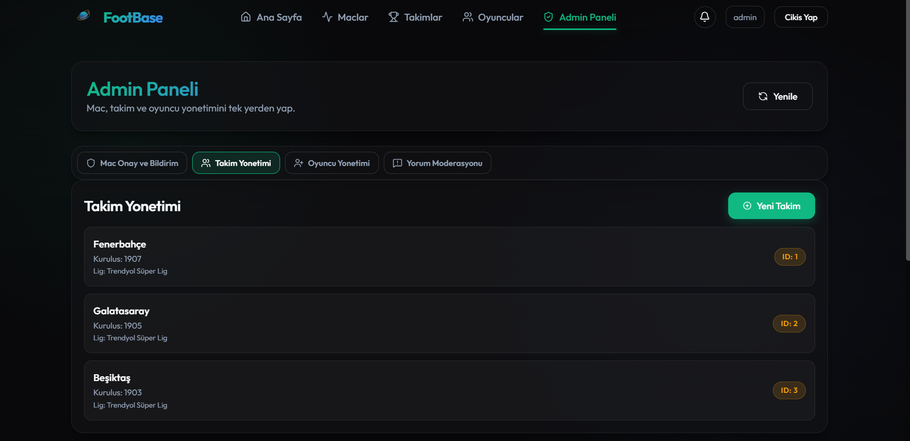

## Gelistirme Notlari

- Backend CORS ayari `http://localhost:3000` icin yapilandirilmistir.
- API base URL frontend tarafinda `frontend/src/services/api.js` icinde `http://localhost:8080/api` olarak tanimlidir.
- Guvenlik konfigurasyonunda su an tum `/api/**` endpointleri acik durumda gorunmektedir (test/development odakli ayar).

## Lisans

Bu repoda lisans dosyasi belirtilmemistir. Gerekirse `LICENSE` dosyasi ekleyebilirsiniz.
